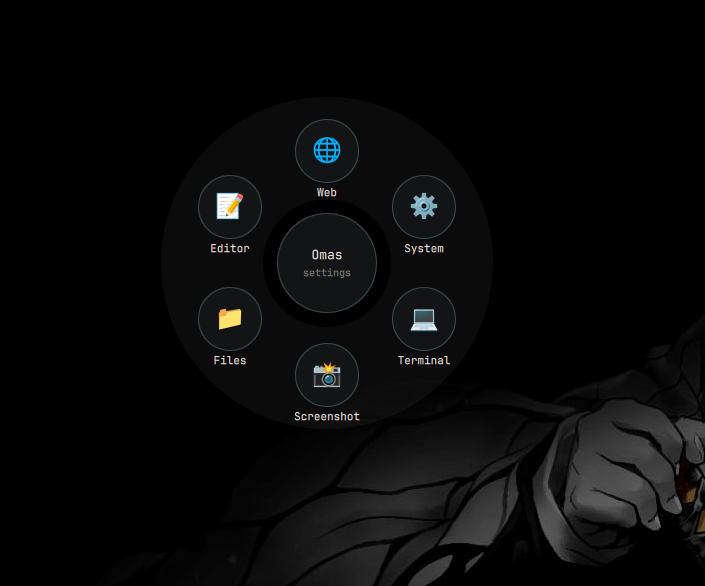
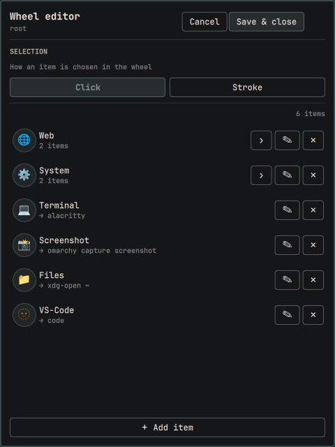
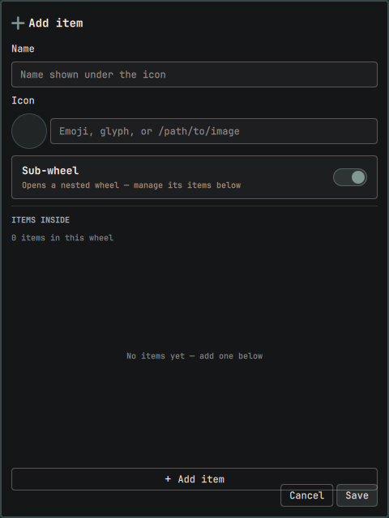

# Omas

Too many keybindings? Use your mouse!

**Omas** is a radial
menu for [Omarchy](https://omarchy.org), built as a native Quickshell shell
plugin. Your first wheel holds categories; each category opens a nested
wheel of commands — and the tree grows exactly as deep as you want. Point
at an item and click — that's all there is to it.



## Features

- **Custom command wheels** — categories, sub-wheels, commands; as many
  items and levels as you like (defined in one JSONC file, hot-reloaded on
  save)
- **Opens under your cursor** — the wheel is summoned right where the
  mouse is (sliding in from the edge when there's no room; falls back to
  the screen center if the cursor position can't be read)
- **Two summon modes** — **click mode** (default): one key press toggles
  the wheel, click an item to run it. **hold mode**: hold the key, flick
  to an item, release to launch it — release again on each sub-wheel to
  descend. Your choice, switched in the wheel editor's main page or set
  in the config
- **Custom icons** — emoji, text glyphs, or image files (a starter icon
  pack ships with the plugin)
- **Built-in editor** — open it right from the wheel's center; add, edit,
  and delete wheels and commands, nest sub-wheels with their items inline,
  and save straight to the config file
- **Native Omarchy integration** — runs inside the omarchy-shell process,
  themed by your Omarchy style, summoned through the standard shell IPC

## Requirements

- [Omarchy](https://omarchy.org) with its Quickshell shell (the default)
- Hyprland (the shell IPC and keybind live there)
- `python3` (used to read the config through a size-capped, no-symlink
  file descriptor; standard on Omarchy systems)

## Installation

The default Omarchy way — install straight from git:

```bash
omarchy plugin add https://github.com/Palccod/Omas.git --enable
```

That clones the plugin into `~/.config/omarchy/plugins/palccod.omas/`,
enables it, and asks the shell to pick it up. A sample wheel config is
created at `~/.config/omarchy/extensions/omas.jsonc` on first launch.

For development, clone the repo into
`~/.config/omarchy/plugins/palccod.omas/` yourself, enable it with
`omarchy plugin enable palccod.omas`, and run
`omarchy-shell shell rescanPlugins` (or `omarchy restart shell`) after
editing files.

## Keybind — SUPER + Z

Omas is summoned through the shell IPC. The default keybind this plugin is
designed for is **SUPER + Z**; it's free in a stock Omarchy setup. How you
bind it depends on the summon mode you pick (see [Configuration](#configuration)):

### Click mode (default) — one binding

Press once to open, once more to dismiss; point and click to run items:

```lua
o.bind("SUPER + Z", "Omas wheel", "omarchy-shell shell toggle palccod.omas")
```

The `toggle` variant and a plain `summon` behave the same in click mode:
pressing while the wheel is up closes it — so the two-line hold setup
below also works if you switch back to click mode.

### Hold mode — two bindings

Press and **hold** — the wheel opens; flick to an item and **release the
keys** to launch it. Releasing on a category descends into its sub-wheel
(the wheel stays up; press and release again for the next level).
Releasing on the center goes **back** one level — at the root wheel it
opens the wheel editor — and releasing off the wheel dismisses it:

```lua
o.bind("SUPER + Z", "Omas wheel", "omarchy-shell shell summon palccod.omas")
o.bind("SUPER + Z", "Omas wheel (release)", "omarchy-shell shell call palccod.omas pick x",
       { release = true })
```

Clicking items still works in hold mode — the release gesture and clicks
coexist, so nothing you know is lost.

**Mouse side buttons** work as hold keys too, e.g. the forward button:

```lua
o.bind("SUPER + mouse:276", "Omas wheel", "omarchy-shell shell summon palccod.omas")
o.bind("SUPER + mouse:276", "Omas wheel (release)", "omarchy-shell shell call palccod.omas pick x",
       { release = true })
```

If the wheel stops responding *after* you add the release binding, your
Omarchy/Hyprland build isn't keeping both binds on the same mouse button
(release-flagged mouse binds were reworked in recent Hyprland releases).
Check that **two** entries are registered — a `bind` and a `bindrd`:

```bash
hyprctl binds | grep -A4 "mouse:276"
```

One entry instead of two → update Omarchy/Hyprland. Releasing without
flicking keeps the wheel open, so a stray press never launches anything.

If your key of choice is already bound by Omarchy defaults, unbind it
first, then bind it to Omas:

```lua
hl.unbind("SUPER + Z")                       -- only if it's already taken
o.bind("SUPER + Z", "Omas wheel", "omarchy-shell shell toggle palccod.omas")
```

(See every current binding with `omarchy menu keybindings --print`.)

Handy IPC variants:

```bash
omarchy-shell shell summon palccod.omas               # open the wheel
omarchy-shell shell summon palccod.omas '{"edit":true}'       # open the editor
omarchy-shell shell hide palccod.omas                 # dismiss
omarchy-shell shell call palccod.omas pick x          # hold mode: launch under cursor
```

## Usage — the user flow

**Click mode** (default):

1. Press **SUPER + Z** — the wheel opens right under your cursor.
2. Point at a category (Web, System, …) and click — its sub-wheel opens.
   The center circle always takes you **back** one level.
3. Point at a command and click — it runs and the wheel closes.
4. At the root wheel, the center circle says **settings**: click it to
   open the wheel editor.

**Hold mode** (after switching to **Hold** on the wheel editor's main
page — or `"mode": "hold"` in the config — and adding the release
keybind):

1. **Hold** **SUPER + Z** — the wheel opens under your cursor while the
   key is down.
2. Flick toward an item and **release** — it runs. Releasing on a
   category opens its sub-wheel instead; hold and release again to pick
   from it. Releasing on the center goes **back** one level (at the root
   wheel it opens the settings editor), and releasing off the wheel
   dismisses it — the wheel never vanishes on a stray release.
3. Clicks and Escape keep working exactly as in click mode.

### The editor

- **Browse** — the root list of your wheel; `›` drills into a sub-wheel,
  `✎` edits, `✕` deletes (with confirmation)
- **Add item** — name, icon, and either a command or the **Sub-wheel**
  toggle. Toggling Sub-wheel reveals the items *inside* it — the same
  list + **+ Add item** UI as the main page — so you build nested wheels
  without ever leaving the form, as deep as you like
- **Cancel** steps back one level (form → list → back to the wheel); it
  never closes the menu. **Save & close** writes the config file and
  applies it immediately — the live wheel updates on the spot

Escape follows the same logic: it cancels a dialog, a form, or the editor
— only at the root wheel does it dismiss the menu.

## Configuration

Everything lives in `~/.config/omarchy/extensions/omas.jsonc` (JSONC —
comments and trailing commas allowed). Edits apply live; the editor writes
this file too.

```jsonc
{
  "mode": "hold",                 // optional: "click" (default) or "hold"
  "items": [
    {
      "name": "Web",
      "icon": "🌐",                   // emoji, glyph, or "/path/to/image.png"
      "children": [
        { "name": "Chromium", "icon": "🌐", "command": "chromium" },
        { "name": "Private window", "icon": "🕵️", "command": "chromium --incognito" }
      ]
    },
    { "name": "Terminal", "icon": "💻", "command": "foot" }
  ]
}
```

- A node with `children` opens a sub-wheel; a node with a `command` runs
  it through bash.
- **`mode`** picks how the keybind behaves: **`"click"`** (default)
  toggles the wheel with a single press — point and click to run. **
  `"hold"`** opens the wheel while the key is held and launches the item
  under the pointer when the keys are released. The release binding
  works in both modes — registering it is what opts you in to the
  gesture — but chained multi-level holds (pressing again on a
  sub-wheel without resetting to the root) need **`"hold"`**. You can
  also flip this with the **Summon mode** switch on the wheel editor's
  main page — it applies when you **Save & close**, and editor saves
  preserve your choice.
- **Sizes are bounded** to protect the long-lived shell: the config file
  is capped at 256 KiB, 200 total items, 8 nesting levels, and per-field
  lengths (name 64, icon/path 256, command 1024 characters). An
  over-limit file is rejected whole — Omas keeps showing the last good
  wheel and says "Config error" in the center — and the editor refuses to
  save an over-limit tree.
- **Icons**: emoji and text glyphs render directly. For images, use an
  absolute path. The plugin ships a starter pack in its install dir —
  `web.png`, `firefox.png`, `private.png`, `system.png`, `lock.png`,
  `power.png`, `reboot.png`, `shutdown.png`, `terminal.png`,
  `screenshot.png`, `files.png`, `vscode.png` — e.g.
  `/home/YOU/.config/omarchy/plugins/palccod.omas/web.png`. Copy in your
  own PNGs and point items at them however you like.

Editor walkthrough:   

## Update

```bash
omarchy plugin update palccod.omas
```

If the shell somehow keeps running old code after an update,
`omarchy restart shell`.

## Removal

```bash
omarchy plugin remove palccod.omas          # disables + deletes the plugin
```

Then remove your config (`~/.config/omarchy/extensions/omas.jsonc`) and
the keybind you added in `bindings.lua`.

## Security & privacy

- **No network access** — Omas never makes network requests
- **No privileged behavior** — no sudo, polkit, services, or system files
- **File access** — reads and writes only
  `~/.config/omarchy/extensions/omas.jsonc` (your own wheel definition).
  Reads are producer-bounded: the file is opened with `O_NOFOLLOW`,
  regular-file-checked, and read at most 256 KiB before anything reaches
  the UI; writes are atomic (temp file + rename) and size-capped. No
  other files are touched
- **Process execution** — runs exactly the shell commands you configure in
  your wheel, when you select them; nothing is executed automatically
- **No data collection** — nothing leaves your machine; there are no
  telemetry, clipboard, or credential reads

## Development notes

- QML sources: `Menu.qml` (wheel, IPC surface),
  `Editor.qml` (settings UI), `PieModel.js` (config parsing/serialization)
- Lint with `qmllint -I /usr/share/omarchy/shell *.qml`, validate with
  `omarchy plugin validate <folder>`
- `omarchy-shell shell call palccod.omas ping x` returns a JSON state
  dump — handy for checking which code the shell is actually running
- Roadmap ideas: item reordering/duplicate in the editor, per-item
  themes (sizes, wedge colors), a mode toggle in the wheel editor

## Credits

- Built on [Quickshell](https://quickshell.outfoxxed.me) and Omarchy's
  shell plugin API

## License

MIT
